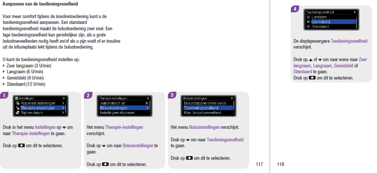

First, the disclaimer: I am not a healthcare professional. This document is created as a personal summary. No medical decisions should be made solely based on this document. **Always consult your medical team before making changes to your diabetes treatment plan.**. Use <a href="https://translate.google.com/translate?hl=en&sl=en&tl=en&u=https%3A%2F%2Fpetervanrijt.github.io%2Flyumjevsummary%2F">this link</a> for an automatic translation using Google Translate.

# Version
Version 0.3, see [8. Version history](#8-version-history).

# Table of contents
<ol start="0">
  <li><a href="#0-preface">Preface</a></li>
  <li><a href="#1-expectations">Expectations</a></li>
  <li><a href="#2-lowering-the-mental-burden">Lowering the mental burden</a></li>
  <li><a href="#3-equipment">Equipment</a></li>
  <li><a href="#4-start-using-with-androidaps">Start using with AndroidAPS</a></li>
  <li><a href="#5-general-hints">General hints</a>
	<ul>
		<li>5.1 <a href="#5-1GETTING_USED_TO_LYUMJEV">GETTING_USED_TO_LYUMJEV</a></li>
		<li>5.2 <a href="#5-2PHYSICAL_TEST">PHYSICAL_TEST</a></li>
		<li>5.3 <a href="#5-3CANNULA_SPOT">CANNULA_SPOT</a></li>
		<li>5.4 <a href="#5-4CANNULA_LENGTH">CANNULA_LENGTH</a></li>
		<li>5.5 <a href="#5-5CANNULA_CHANGE">CANNULA_CHANGE</a></li>
		<li>5.6 <a href="#5-6BOLUS_SPEED">BOLUS_SPEED</a></li>
		<li>5.7 <a href="#5-7BOLUS_MAXIMIZE">BOLUS_MAXIMIZE</a></li>
		<li>5.8 <a href="#5-8BOLUS_PARTLY_UAM">BOLUS_PARTLY_UAM</a></li>
		<li>5.9 <a href="#5-9BOLUS_FULL_UAM">BOLUS_FULL_UAM</a></li>
		<li>5.10 <a href="#5-10BASAL_CIRCADIAN">BASAL_CIRCADIAN</a></li>
		<li>5.11 <a href="#5-11EAT_MORE_OFTEN">EAT_MORE_OFTEN</a></li>
		<li>5.12 <a href="#5-12INSULIN_CONCENTRATION">INSULIN_CONCENTRATION</a></li>
		<li>5.13 <a href="#5-13INSULIN_MIXING">INSULIN_MIXING</a></li>
		<li>5.14 <a href="#5-14YPSOMED_REUSE">YPSOMED_REUSE</a></li>
		<li>5.15 <a href="#5-15SWITCH_FIASP">SWITCH_FIASP</a></li>
	</ul></li>
  <li><a href="#6-i-need-help">I need help</a></li>
  <li><a href="#7-overview-of-partly-used-sources">Overview of (partly) used sources</a></li>
  <li><a href="#8-version-history">Version history</a></li>
</ol>

# 0. Preface 
This document is part of <a href="https://petervanrijt.nl/category/diabetes/" target="_blank">my blog series</a>. I do not have – and do not want – any sponsorship deals or whatsoever and pay for all equipment just like anybody else. 

For quite some time, I have been reading on Lyumjev and looping. Last week we started with using Lyumjev ourselves. I have summarized all tips I have read in this PowerPoint. Creating it took me quite some time, with several months in preparation by reading and saving links.

I am convinced it is a waste of resources when everybody does the same and asks the same questions on the do-it-yourself Facebook groups. When everybody provides feedback on this summary, (new) users can improve faster with fewer basic questions, and therefore have more time to improve their personal settings. 

Information in this presentation is found online, which has been shared by the online do-it-yourself community. See <a href="#7-overview-of-partly-used-sources">chapter 7 for an overview of all (partly) used sources</a>. I want to give a BIG THANK YOU to all volunteers and medical professionals, contributing to this new do-it-yourself treatment of diabetes.

I am Peter, a millennial born in 1984, living in The Netherlands, and hope someone will find a cure for type 1 diabetes (T1D) fast. Since my girlfriend got the T1D-diagnose, both of our lives have rapidly changed. I became involved as a volunteer on the AndroidAPS project. 

I commit my IT Service Delivery Management passion to a more comfortable and healthier diabetes life because of all automation possible since 2013. As a professional, I feel comfortable delivering value, overseeing all components while managing staff and costs.

All the best, 
Peter #wearenotwaiting #payitforward

# 1. Expectations 
1. Improved Time In Range (TIR);
2. Less hypers, better avoidance of hypos;
3. Less manual interventions, therefore lowering the mental burden;
4. Improved HbA1C;
5. No carbohydrate entry necessary, and therefore no boluses (see <a href="#2-lowering-the-mental-burden">chapter 2</a>).

# 2. Lowering the mental burden 
> Our assumption for ‘a good quality of life’ is the combination of physical health (body) and psychological health (little as possible manual interventions). Closed loop systems really have improved my girlfriend’s physical health and ensure less worrying (especially at night). We both are very grateful for this. At the same time, I see a physical burden arise. This because all (sensor) data, options, and alerts are always available. In one of our home discussions with my girlfriend, I asked what is most important to her. She mentioned:
>
> 1. a healthy HbA1c
> 2. a good TIR
> 3. fewer life interruptions because of diabetes
>
> Her deepest desire is to live a normal – as possible – life without being bothered by diabetes. And stay healthy in the long run!

The above quote is the introduction of my blog post <a href="https://petervanrijt.nl/2021/01/08/my-first-feature-request-to-the-open-source-community/" target="_blank">My first feature request to the open source community: unburdening diabetes care</a> (or GitHub <a href="https://github.com/nightscout/cgm-remote-monitor/issues/6717" target="_blank">Nightscout issue 6717</a>). The blog post suggests ADMI (Average Daily Manual Interactions) as a new psychical metric. 

Bernd Herpichböhm has made profound contributions on the challenge of lowering the mental burden of diabetes. With his research, it seems Bernd has solved the puzzle Dana Lewis wrote in the Artificial Pancreas Book: '<a href="https://www.artificialpancreasbook.com/1.-whats-a-closed-loop-or-artificial-pancreas-system-and-why-would-someone-use-one#choose-one-what-would-you-give-up-if-you-could" target="_blank">Choose one - what would you give up if you could?</a>'. It seems, with much testing (basal rate, I/C, ISF, and DIA) and custom triggers, it is possible to get a 5 out of 5:

+ No need to bolus 
+ No need to count carbs 
+ Medium/high carb meals 
+ 80%+ time in range  
+ No hypoglycemia

See these Facebook links <a href="https://www.facebook.com/groups/AndroidAPSUsers/permalink/2924763827745015/" target="_blank">v.5_02 E</a> and <a href="https://www.facebook.com/groups/AndroidAPSUsers/permalink/2932619803626084" target="_blank">v.5.4_12</a>, which point to "This is a update on Looping without bolussing, and without carb inputs.", to use with AndroidAPS or OpenAPS. Also, see <a href="https://www.diabettech.com/oref1/lyumjev-a-fully-closed-loop-case-study-with-oref1/" target="_blank">https://www.diabettech.com/oref1/lyumjev-a-fully-closed-loop-case-study-with-oref1/</a> and <a href="https://www.diabettech.com/wp-content/uploads/2020/10/Lyumjev_w.UAM-week_Be_13Oct20.pdf" target="_blank">https://www.diabettech.com/wp-content/uploads/2020/10/Lyumjev_w.UAM-week_Be_13Oct20.pdf</a>.

# 3. Equipment 
In our setup, we use:

+ <a href="https://www.accu-chek.nl/insight-classic" target="_blank">Accu-Chek Insight pump</a>
+ Lyumjev U100 insulin pens (make sure you Lyumjev, instead of Lispro)
+ AndroidAPS (latest version, currently <a href="https://github.com/nightscout/AndroidAPS/releases/tag/2.8.2" target="_blank">2.8.2</a>)
+ Ypsomed ampuls, which you need to fill yourself using the insulin pens.

Contact your healthcare provider to finance all equipment.

# 4. Start using with AndroidAPS 
+ Online, you will read to lower Duration of Insulin Activity (DIA) somewhere between 5 – 6 hours. We have used 5,5 hours. Of course, you can perform a physical test on your DIA.
+ In AndroidAPS set insulin type on Lyumjev. See <a href="https://androidaps.readthedocs.io/en/latest/Configuration/Config-Builder.html#lyumjev" target="_blank">https://androidaps.readthedocs.io/en/latest/Configuration/Config-Builder.html#lyumjev</a>
+ In the minority are users who raise ISF, in the beginning, to be slightly less aggressive. With this, they can see body reactions to the new insulin type. We have not done this. I think it is better to physically test your basal, I/C, and ISF beforehand but I do understand this shortcut. 
+ Use ‘eating soon’ mode (see <a href="https://androidaps.readthedocs.io/en/latest/Usage/temptarget.html#eating-soon-temp-target" target="_blank">manual</a>, <a href="https://diyps.org/2015/03/26/how-to-do-eating-soon-mode-diyps-lessons-learned/" target="_blank">hyperlink 26-mar-2015</a>, <a href="https://diyps.org/2016/07/11/picture-this-how-to-do-eating-soon-mode/" target="_blank">hyperlink 11-jul-2016</a>, <a href="https://diyps.org/tag/eating-soon-mode/" target="_blank">hyperlink 20-feb-2019</a>) or enter carbohydrates by using a pre-bolus. Dana Lewis states in her blog of 11-jul-2016 a preference for ‘eating soon’.
+ Because Lyumjev works much quicker, sport could be a consideration. Online there is a discussion on this topic: <a href="https://www.facebook.com/groups/AndroidAPSUsers/posts/3043094085911988/" target="_blank">https://www.facebook.com/groups/AndroidAPSUsers/posts/3043094085911988/</a>.

# 5. General hints 
+ 5.1 [GETTING_USED_TO_LYUMJEV](#5-1GETTING_USED_TO_LYUMJEV)
+ 5.2 [PHYSICAL_TEST](#5-2PHYSICAL_TEST)
+ 5.3 [CANNULA_SPOT](#5-3CANNULA_SPOT)
+ 5.4 [CANNULA_LENGTH](#5-4CANNULA_LENGTH)
+ 5.5 [CANNULA_CHANGE](#5-5CANNULA_CHANGE)
+ 5.6 [BOLUS_SPEED](#5-6BOLUS_SPEED)
+ 5.7 [BOLUS_MAXIMIZE](#5-7BOLUS_MAXIMIZE)
+ 5.8 [BOLUS_PARTLY_UAM](#5-8BOLUS_PARTLY_UAM)
+ 5.9 [BOLUS_FULL_UAM](#5-9BOLUS_FULL_UAM)
+ 5.10 [BASAL_CIRCADIAN](#5-10BASAL_CIRCADIAN)
+ 5.11 [EAT_MORE_OFTEN](#5-11EAT_MORE_OFTEN)
+ 5.12 [INSULIN_CONCENTRATION](#5-12INSULIN_CONCENTRATION)
+ 5.13 [INSULIN_MIXING](#5-13INSULIN_MIXING)
+ 5.14 [YPSOMED_REUSE](#5-14YPSOMED_REUSE)
+ 5.15 [SWITCH_FIASP](#5-15SWITCH_FIASP)

## 5.1 GETTING_USED_TO_LYUMJEV 
I have read stories about different feelings when administering insulin (nothing, burning, painful, unbearable). And that it can be different for people. Users report their body adjusts on bolussing with Lyumjev, and reports suggest the habituation period will take somewhere between 1 – 2 months.

The Dutch site Diabeter, <a href="https://translate.google.com/translate?hl=en&sl=nl&tl=nl&u=https%3A%2F%2Fdiabeter.nl%2Fnl%2Fover-diabeter%2Fnieuws%2Flyumjev-snelwerkende-insuline%2F" target="_blank">see this direct link for an automatic Google Translation</a>, published a background article on why the body reacts differently to Lyumjev than to Humalog.

## 5.2 PHYSICAL_TEST 
Closed loop systems are a true blessing and definitely here to stay. A big thanks to everyone involved! 

To make the most of your (do-it-yourself) closed loop systems we all need to have the best possible basic settings (basal rate, I/C, ISF, and DIA). These settings are essential to reduce the number of manual interventions. There is a high risk of poor regulation without the proper settings, and therefore difficult to avoid hypos and hypers. Because when using the wrong basic settings, it can be very annoying or even dangerous. For most of us, this means physical testing and tweaking all basic settings regularly.

Bundled four of my favorite resources to help you determine basic settings:

<ol>
	<li>Your medical team.</li>
	<li>Visit <a href="https://waltzingthedragon.ca/" target="_blank">Waltzing the Dragon | Taming the dragon together</a>. This website is practical and informational, with tips from the trenches. I don't see this kind of information bundled on other sites. Loads of articles, I want to highlight the following:
		<ul>
			<li><a href="https://waltzingthedragon.ca/diabetes/managing-bg/adjusting-insulin-pump-assessing-pump-basal-rates/" target="_blank">Testing and Tweaking Basal Rates</a></li>
			<li><a href="https://waltzingthedragon.ca/diabetes/managing-bg/adjusting-insulin-pump-insulin-to-carb-ratios/" target="_blank">Adjusting Insulin-to-Carbohydrate Ratios (I/C)</a></li>
			<li><a href="https://waltzingthedragon.ca/diabetes/managing-bg/adjusting-insulin-pump-insulin-sensitivity-factor-isf-correcting-high-blood-glucose/" target="_blank">Adjusting Insulin Sensitivity Factor (ISF)</a></li>
			<li><a href="https://waltzingthedragon.ca/diabetes/managing-bg/adjusting-insulin-pump-duration-of-insulin-action-dia/" target="_blank">Duration of Insulin Action (DIA)</a></li>
		</ul>
	</li>
	<li>Book. Think Like a Pancreas: A Practical Guide to Managing Diabetes (3rd edition) from author Gary Schneider. ISBN paperback: 978-0-7382-4668-0 / ISBN e-book: 978-0-7382-4669-7.  
  
This author has publications for many years (just search online), and as T1D also has loads of practical experience. In various Facebook groups, his book is recommended. I bought the e-book myself and sometimes laughed out loud while reading it. A pleasant writing style with a high information density.</li>
	<li>Currently, I am working on <a href="https://nightscoutsuggestions.com" target="_blank">https://nightscoutsuggestions.com</a> to help with basal testing based on Nightscout data. It is a prototype yet to go live with version 1.</li>
</ol>

## 5.3 CANNULA_SPOT 
Online, some users report some good results switching cannula spots because it causes less pain and perhaps less insulin stacking. I have read spots back, buttock and belly.

## 5.4 CANNULA_LENGTH 
In several Facebook topics, I saw people try different cannula lengths. They mention that a longer cannula could lead to less pain on bolussing. For example, an original length of 6mm (painful) compared to 10mm (sensitive). Because of this, it may also be an improvement that infusion sets can last longer.

I saw the story on a Dutch Facebook site but do not know if 'a medical team' can verify this: "_The nerves are located in the dermis, the thickness of the dermis is up to 3mm. If you use a 6 mm cannula, the insulin only needs to travel about 3 mm upwards to reach the nerves and generate a pain stimulus. With a cannula of 10 mm, the distance to be covered is 7 mm. The insulin has therefore spread over a larger surface, so that the concentration that eventually reaches the nerve will be smaller, resulting in less sensitivity._".

## 5.5 CANNULA_CHANGE 
In some Facebook topics, I saw people suggest changing cannula spots every two days. Frequent changing could help to reduce pain, or a burning feeling, on bolussing. 

## 5.6 BOLUS_SPEED 
In Facebook groups, many users of Lyumjev report less pain (and perhaps less insulin stacking) when insulin is administered slowly. Insulin pumps often have an option to adjust the rate of insulin delivery. See this example from the <a href="https://www.accu-chek.nl/download/file/fid/19201" target="_blank">Accu-Chek Insight manual</a> (page 117 & 118):

## 5.7 BOLUS_MAXIMIZE 
Online, users are reporting that a body probably will adjust in bolussing Lyumjev. Reports suggest it will take somewhere between 1 – 2 months.

When bolussing is painful, you could learn to what extend you can handle a bolus amount. With that knowledge, you can manually maximize it. When a meal exceeds your personal limit, try to administer a bolus manual several times with short intervals.

## 5.8 BOLUS_PARTLY_UAM 
Online, users are reporting that a body probably will adjust in bolussing Lyumjev. Reports suggest it will take somewhere between 1 – 2 months. 

When bolussing is painful, you could learn to what extend you can handle a bolus amount. This tip is copied from <a href="https://www.diabettech.com/faster-insulin/lyumjev-part-4-persistence-is-king/" target="_blank">https://www.diabettech.com/faster-insulin/lyumjev-part-4-persistence-is-king/</a>: "_I've also changed the way that I use the insulin, manually bolussing only small amounts and relying on SMB for everything else. That’s a little different to what I was doing in my first week of use where I was taking larger doses._".

## 5.9 BOLUS_FULL_UAM 
Online, users are reporting that a body probably will adjust in bolussing Lyumjev. Reports suggest it will take somewhere between 1 – 2 months. 

This tip is mentioned in <a href="#2-lowering-the-mental-burden">chapter 2 'Lowering the mental burden'</a> of this document. The tips are for advanced users, have a steep learning curve, and need severe perseverance of patients. You will need to invest time and, (hopefully) you will gain a life without bolussing because of using SMB and UAM only.

## 5.10 BASAL_CIRCADIAN 
When you encounter the problem of finding the proper (basal rate, I/C, ISF) settings, which is crucial in using BOLUS_FULL_UAM, you could consider discussing the use of a circadian profile. Online I read a number of users getting good results with these settings. See <a href="https://www.facebook.com/groups/AndroidAPSUsers/permalink/2869638923257505" target="_blank">https://www.facebook.com/groups/AndroidAPSUsers/permalink/2869638923257505</a>. To search the proper I/C and ISF settings for this model, on Facebook two documents are published by Bernd Herpichböhm:
+ <a href="https://www.facebook.com/groups/AndroidAPSUsers/permalink/2927820974105967/" target="_blank">How to determine the IC factor (carb ratio)</a>
+ <a href="https://www.facebook.com/groups/AndroidAPSUsers/permalink/2927820624106002/" target="_blank">How to determine ISF</a>

## 5.11 EAT_MORE_OFTEN 
Online, users are reporting that a body probably will adjust in bolussing Lyumjev. Reports suggest it will take somewhere between 1 – 2 months. 

When bolussing is painful, there is always the option to reduce boluses by eating more often, and therefore bolus smaller amounts.

## 5.12 INSULIN_CONCENTRATION 
Lyumjev is supplied as a standard concentration of U100. There is also Lyumjev U200, double concentrated. U200 means a smaller bolus is needed and thus possibly a less painful feeling during the habituation period. Also, insulin accumulation seems less likely. On Facebook, I see positive reactions on U200:
+ "_it is far way better for the cannula site than U100._"
+ "_I prefer it to the U100 by far._"
+ "_I second (or third) Cristina and Tim. Additionally, since using U200 I never felt pain when insulin was injected._"
+ "_Also use U200 and for me it was really better_"

The option to select Lyumjev in AndroidAPS is not available. For this, there was a discussion on GitHub <a href="https://github.com/nightscout/AndroidAPS/issues/527" target="_blank">Nightscout – AndroidAPS, issue 527, Lyumjev U200/ML</a>: "Request to make an adjustment in AndroidAPS to use Lyumjev U200/ml safely.". Also, see Facebook posts like <a href="https://www.facebook.com/groups/AndroidAPSUsers/permalink/3001351296752934/" target="_blank">https://www.facebook.com/groups/AndroidAPSUsers/permalink/3001351296752934/</a> and <a href="https://www.facebook.com/groups/loopednl/posts/751246758905091/" target="_blank">https://www.facebook.com/groups/loopednl/posts/751246758905091/</a>.

You need to be an advanced user to consider Lyumjev 200. The 'do-it-yourself community' did find a way to use Lyumjev U200 with AndroidAPS. In AndroidAPS, you need to make several adjustments for the <a href="https://androidaps.readthedocs.io/en/latest/Configuration/Config-Builder.html?highlight=lyumjev#lyumjev" target="_blank">Lyumjev insulin type</a>:
+ Halve basal (some users cite an 'extra margin of safety': basal / 2 * 0.9);
+ Double ISF (some users mention an 'extra margin of safety': ISF * 2 * 1.1);
+ Double I/C (some users call an 'extra margin of safety’: I/C * 2 * 0.9);
+ Correct AndroidAPS security settings such as max IOB, max bolus, and max basal;
+ U200 is twice as strong as 'normal insulin'. Be careful with 'calculating units manually’. Make sure you get used to this way of calculating!

## 5.13 INSULIN_MIXING 
Online, users are reporting that a body probably will adjust in bolussing Lyumjev. Reports suggest it will take somewhere between 1 – 2 months. 

When bolussing is painful, some users online report that mixing Humalog with Lyumjev will help normal bolus amounts without too much pain. Steps I have read: 
+ 50% Humalog /50% Lyumjev;
+ 33% Humalog / 67% Lyumjev;
+ 0% Humalog / 100% Lyumjev.

## 5.14 YPSOMED_REUSE 
In the Netherlands, health insurance pays for the equipment almost in full (see <a href="#3-equipment">chapter 3</a>). Despite that, on a private Facebook chat, I spoke with a do-it-yourself community member. He/she mentioned reusing the Ypsomed ampuls once to lower equipment costs. 

## 5.15 SWITCH_FIASP 
Sorry to hear, despite all hints from the online community, Lyumjev is too uncomfortable for you. You could consider discussing the use of Fiasp with your medical team, which is slower compared to Lyumjev but faster than NovoRapid.

# 6. I need help 

As mentioned in the prefix, I am not a healthcare professional. This document is created as a personal summary. No medical decisions should be made solely based on this document. **Always consult your medical team before making changes to your diabetes treatment plan**.

Online, several Facebook groups – and websites – provide do-it-yourself suggestions, background stories, and information. For this, see Facebook groups like <a href="https://www.facebook.com/groups/AndroidAPSUsers/" target="_blank">AndroidAPS Users</a>, <a href="https://www.facebook.com/groups/theloopedgroup/" target="_blank">TheLoopedGroup</a> and <a href="https://www.facebook.com/groups/loopednl/" target="_blank">LoopedNl</a>.

# 7. Overview of (partly) used sources 

+ <a href="https://androidaps.readthedocs.io/" target="_blank">https://androidaps.readthedocs.io/</a>
+ <a href="https://androidaps.readthedocs.io/en/latest/Configuration/Config-Builder.html#lyumjev" target="_blank">https://androidaps.readthedocs.io/en/latest/Configuration/Config-Builder.html#lyumjev</a>
+ <a href="https://androidaps.readthedocs.io/en/latest/Usage/temptarget.html#eating-soon-temp-target" target="_blank">https://androidaps.readthedocs.io/en/latest/Usage/temptarget.html#eating-soon-temp-target</a>
+ <a href="https://bionicwookiee.com/2021/04/26/subtleties-of-insulin-duration/" target="_blank">https://bionicwookiee.com/2021/04/26/subtleties-of-insulin-duration/</a>
+ <a href="https://diabeter.nl/nl/over-diabeter/nieuws/lyumjev-snelwerkende-insuline/" target="_blank">https://diabeter.nl/nl/over-diabeter/nieuws/lyumjev-snelwerkende-insuline/</a>
+ <a href="https://diyps.org/2015/03/26/how-to-do-eating-soon-mode-diyps-lessons-learned/" target="_blank">https://diyps.org/2015/03/26/how-to-do-eating-soon-mode-diyps-lessons-learned/</a>
+ <a href="https://diyps.org/2016/07/11/picture-this-how-to-do-eating-soon-mode/" target="_blank">https://diyps.org/2016/07/11/picture-this-how-to-do-eating-soon-mode/</a>
+ <a href="https://diyps.org/tag/eating-soon-mode/" target="_blank">https://diyps.org/tag/eating-soon-mode/</a>
+ <a href="https://github.com/nightscout/AndroidAPS" target="_blank">https://github.com/nightscout/AndroidAPS</a>
+ <a href="https://github.com/nightscout/AndroidAPS/issues/527" target="_blank">https://github.com/nightscout/AndroidAPS/issues/527</a>
+ <a href="https://github.com/nightscout/AndroidAPS/releases/tag/2.8.2" target="_blank">https://github.com/nightscout/AndroidAPS/releases/tag/2.8.2</a>
+ <a href="https://github.com/nightscout/cgm-remote-monitor/issues/6717" target="_blank">https://github.com/nightscout/cgm-remote-monitor/issues/6717</a>
+ <a href="https://ikwachtniet.blogspot.com/2021/05/7-dagen-lyumjev.html" target="_blank">https://ikwachtniet.blogspot.com/2021/05/7-dagen-lyumjev.html</a>
+ <a href="https://ikwachtniet.blogspot.com/2021/05/beginnen-met-lyumjev.html" target="_blank">https://ikwachtniet.blogspot.com/2021/05/beginnen-met-lyumjev.html</a>
+ <a href="https://petervanrijt.nl/category/diabetes/" target="_blank">https://petervanrijt.nl/category/diabetes/</a>
+ <a href="https://waltzingthedragon.ca/" target="_blank">https://waltzingthedragon.ca/</a>
+ <a href="https://waltzingthedragon.ca/diabetes/managing-bg/adjusting-insulin-pump-assessing-pump-basal-rates/" target="_blank">https://waltzingthedragon.ca/diabetes/managing-bg/adjusting-insulin-pump-assessing-pump-basal-rates/</a>
+ <a href="https://waltzingthedragon.ca/diabetes/managing-bg/adjusting-insulin-pump-duration-of-insulin-action-dia/" target="_blank">https://waltzingthedragon.ca/diabetes/managing-bg/adjusting-insulin-pump-duration-of-insulin-action-dia/</a>
+ <a href="https://waltzingthedragon.ca/diabetes/managing-bg/adjusting-insulin-pump-insulin-sensitivity-factor-isf-correcting-high-blood-glucose/" target="_blank">https://waltzingthedragon.ca/diabetes/managing-bg/adjusting-insulin-pump-insulin-sensitivity-factor-isf-correcting-high-blood-glucose/</a>
+ <a href="https://waltzingthedragon.ca/diabetes/managing-bg/adjusting-insulin-pump-insulin-to-carb-ratios/" target="_blank">https://waltzingthedragon.ca/diabetes/managing-bg/adjusting-insulin-pump-insulin-to-carb-ratios/</a>
+ <a href="https://www.accu-chek.nl/download/file/fid/19201" target="_blank">https://www.accu-chek.nl/download/file/fid/19201</a>
+ <a href="https://www.accu-chek.nl/insight-classic" target="_blank">https://www.accu-chek.nl/insight-classic</a>
+ <a href="https://www.artificialpancreasbook.com/1.-whats-a-closed-loop-or-artificial-pancreas-system-and-why-would-someone-use-one#choose-one-what-would-you-give-up-if-you-could" target="_blank">https://www.artificialpancreasbook.com/1.-whats-a-closed-loop-or-artificial-pancreas-system-and-why-would-someone-use-one#choose-one-what-would-you-give-up-if-you-could</a>
+ <a href="https://www.diabetestype1.nl/gesprekken/behandeling/718-wanneer-mogen-we-eindelijk-eens-lyumjev-insuline-gaan-gebruiken-in-nederland" target="_blank">https://www.diabetestype1.nl/gesprekken/behandeling/718-wanneer-mogen-we-eindelijk-eens-lyumjev-insuline-gaan-gebruiken-in-nederland</a>
+ <a href="https://www.diabettech.com/faster-insulin/lyumjev-part-4-persistence-is-king/" target="_blank">https://www.diabettech.com/faster-insulin/lyumjev-part-4-persistence-is-king/</a>
+ <a href="https://www.diabettech.com/fiasp/lyumjev-what-next-another-n1-experiment/" target="_blank">https://www.diabettech.com/fiasp/lyumjev-what-next-another-n1-experiment/</a>
+ <a href="https://www.diabettech.com/lyumjev/living-with-lyumjev-almost-a-year-in-review/" target="_blank">https://www.diabettech.com/lyumjev/living-with-lyumjev-almost-a-year-in-review/</a>
+ <a href="https://www.diabettech.com/lyumjev/lyumjev-ultra-rapid-in-some-circumstances/" target="_blank">https://www.diabettech.com/lyumjev/lyumjev-ultra-rapid-in-some-circumstances/</a>
+ <a href="https://www.diabettech.com/oref1/lyumjev-a-fully-closed-loop-case-study-with-oref1/" target="_blank">https://www.diabettech.com/oref1/lyumjev-a-fully-closed-loop-case-study-with-oref1/</a>
+ <a href="https://www.diabettech.com/wp-content/uploads/2020/10/Lyumjev_w.UAM-week_Be_13Oct20.pdf" target="_blank">https://www.diabettech.com/wp-content/uploads/2020/10/Lyumjev_w.UAM-week_Be_13Oct20.pdf</a>
+ <a href="https://www.dvn.nl/nieuws/nieuwsbericht/nieuwe-snelwerkende-insuline-vanaf-mei-verkrijgbaar" target="_blank">https://www.dvn.nl/nieuws/nieuwsbericht/nieuwe-snelwerkende-insuline-vanaf-mei-verkrijgbaar</a>
+ <a href="https://www.ema.europa.eu/en/documents/product-information/lyumjev-previously-liumjev-epar-product-information_nl.pdf" target="_blank">https://www.ema.europa.eu/en/documents/product-information/lyumjev-previously-liumjev-epar-product-information_nl.pdf</a>
+ <a href="https://www.facebook.com/groups/AndroidAPSUsers/" target="_blank">https://www.facebook.com/groups/AndroidAPSUsers/</a>
+ <a href="https://www.facebook.com/groups/AndroidAPSUsers/permalink/2869638923257506/" target="_blank">https://www.facebook.com/groups/AndroidAPSUsers/permalink/2869638923257506/</a>
+ <a href="https://www.facebook.com/groups/AndroidAPSUsers/permalink/2924763827745015/" target="_blank">https://www.facebook.com/groups/AndroidAPSUsers/permalink/2924763827745015/</a>
+ <a href="https://www.facebook.com/groups/AndroidAPSUsers/permalink/2927820624106002/" target="_blank">https://www.facebook.com/groups/AndroidAPSUsers/permalink/2927820624106002/</a>
+ <a href="https://www.facebook.com/groups/AndroidAPSUsers/permalink/2927820974105967/" target="_blank">https://www.facebook.com/groups/AndroidAPSUsers/permalink/2927820974105967/</a>
+ <a href="https://www.facebook.com/groups/AndroidAPSUsers/permalink/2932619803626084" target="_blank">https://www.facebook.com/groups/AndroidAPSUsers/permalink/2932619803626084</a>
+ <a href="https://www.facebook.com/groups/AndroidAPSUsers/permalink/2994806724074058/" target="_blank">https://www.facebook.com/groups/AndroidAPSUsers/permalink/2994806724074058/</a>
+ <a href="https://www.facebook.com/groups/AndroidAPSUsers/permalink/3001351296752934/" target="_blank">https://www.facebook.com/groups/AndroidAPSUsers/permalink/3001351296752934/</a>
+ <a href="https://www.facebook.com/groups/AndroidAPSUsers/permalink/3038280249726705/" target="_blank">https://www.facebook.com/groups/AndroidAPSUsers/permalink/3038280249726705/</a>
+ <a href="https://www.facebook.com/groups/AndroidAPSUsers/permalink/3061441790743884/" target="_blank">https://www.facebook.com/groups/AndroidAPSUsers/permalink/3061441790743884/</a>
+ <a href="https://www.facebook.com/groups/AndroidAPSUsers/posts/2927049524183112/" target="_blank">https://www.facebook.com/groups/AndroidAPSUsers/posts/2927049524183112/</a>
+ <a href="https://www.facebook.com/groups/AndroidAPSUsers/posts/2984258775128853/" target="_blank">https://www.facebook.com/groups/AndroidAPSUsers/posts/2984258775128853/</a>
+ <a href="https://www.facebook.com/groups/AndroidAPSUsers/posts/3004036296484434/" target="_blank">https://www.facebook.com/groups/AndroidAPSUsers/posts/3004036296484434/</a>
+ <a href="https://www.facebook.com/groups/AndroidAPSUsers/posts/3043094085911988/" target="_blank">https://www.facebook.com/groups/AndroidAPSUsers/posts/3043094085911988/</a>
+ <a href="https://www.facebook.com/groups/AndroidAPSUsers/posts/3057574124463984/" target="_blank">https://www.facebook.com/groups/AndroidAPSUsers/posts/3057574124463984/</a>
+ <a href="https://www.facebook.com/groups/AndroidAPSUsers/posts/3059345730953490/" target="_blank">https://www.facebook.com/groups/AndroidAPSUsers/posts/3059345730953490/</a>
+ <a href="https://www.facebook.com/groups/AndroidAPSUsers/posts/3061233560764707" target="_blank">https://www.facebook.com/groups/AndroidAPSUsers/posts/3061233560764707</a>
+ <a href="https://www.facebook.com/groups/AndroidAPSUsers/posts/3061441790743884/" target="_blank">https://www.facebook.com/groups/AndroidAPSUsers/posts/3061441790743884/</a>
+ <a href="https://www.facebook.com/groups/AndroidAPSUsers/posts/3063726260515437/" target="_blank">https://www.facebook.com/groups/AndroidAPSUsers/posts/3063726260515437/</a>
+ <a href="https://www.facebook.com/groups/loopednl/" target="_blank">https://www.facebook.com/groups/loopednl/</a>
+ <a href="https://www.facebook.com/groups/loopednl/permalink/704736480222786/" target="_blank">https://www.facebook.com/groups/loopednl/permalink/704736480222786/</a>
+ <a href="https://www.facebook.com/groups/loopednl/permalink/752258162137284/" target="_blank">https://www.facebook.com/groups/loopednl/permalink/752258162137284/</a>
+ <a href="https://www.facebook.com/groups/loopednl/permalink/777967796232987/" target="_blank">https://www.facebook.com/groups/loopednl/permalink/777967796232987/</a>
+ <a href="https://www.facebook.com/groups/loopednl/permalink/780373889325711/" target="_blank">https://www.facebook.com/groups/loopednl/permalink/780373889325711/</a>
+ <a href="https://www.facebook.com/groups/loopednl/permalink/790710684958698/" target="_blank">https://www.facebook.com/groups/loopednl/permalink/790710684958698/</a>
+ <a href="https://www.facebook.com/groups/loopednl/posts/748389899190777/" target="_blank">https://www.facebook.com/groups/loopednl/posts/748389899190777/</a>
+ <a href="https://www.facebook.com/groups/loopednl/posts/751246758905091/" target="_blank">https://www.facebook.com/groups/loopednl/posts/751246758905091/</a>
+ <a href="https://www.facebook.com/groups/loopednl/posts/791642361532197/" target="_blank">https://www.facebook.com/groups/loopednl/posts/791642361532197/</a>
+ <a href="https://www.facebook.com/groups/theloopedgroup/" target="_blank">https://www.facebook.com/groups/theloopedgroup/</a>
+ Book. Think Like a Pancreas: A Practical Guide to Managing Diabetes (3rd edition) from author Gary Schneider. ISBN paperback: 978-0-7382-4668-0 / ISBN e-book: 978-0-7382-4669-7.
+ Facebook chats with other do-it-yourself members.
+ <a target="_blank" href="https://icons8.com/icon/26124/slide-up">Slide Up</a> icon by <a target="_blank" href="https://icons8.com">Icons8</a>

# 8. Version history 
+ v0.3: added links for automatic Google Translation (2x).
+ v0.2: processed feedback (6x).
+ v0.1: initial commit, copied from <a href="https://www.facebook.com/groups/AndroidAPSUsers/posts/3067666210121442/" target="_blank">my Facebook topic</a>.